# Game Compatibility

Compatibility is still experimental. The results below cover startup and
initial rendering only and do not imply complete gameplay support.

The current sample set contains 39 distinct `.app` entries, including alternate
builds of several games. On August 13, 2026, all 39 entries completed the release
batch screenshot process and rendered a non-black frame. The newer Hell Striker
II build and Overlord Fighter use 300-frame and 120-frame capture overrides,
respectively; Sword and Fairy uses 1200 frames because its startup sequence
contains several timed splash screens. Input, audio, save data, extended
gameplay, and full completion still require separate verification.

Overlord Fighter has a separate real-game regression test for its legacy
resource-conversion imports, title-screen framebuffer output, and direct button
polling. A scripted A-button press leaves the title menu and starts the game.

GooPlayer's content-discovery check confirms that its startup scan finds the
three companion tracker files in the game directory and opens the playlist
instead of remaining on the title screen. Playback correctness is not part of
this check.

## Verified Games

| English Name | 中文名 | Filename | Screenshot | Status |
|--------------|--------|----------|------------|--------|
| Ali Baba | 阿里巴巴 | `tmp/dingoo_game/AliBaba.app` |  | ✅ Pass |
| Astro Lander | 星际着陆 | `tmp/dingoo_game/Astro-Lander/Astro-Lander.app` | 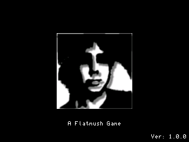 | ✅ Pass |
| Block Breaker | 打砖块 | `tmp/dingoo_game/Block Breaker.app` | 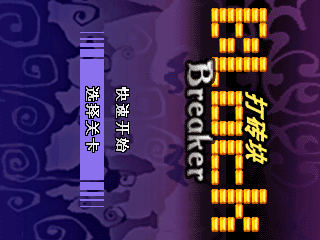 | ✅ Pass |
| Candy | 糖果屋 | `tmp/dingoo_game/Candy.app` |  | ✅ Pass |
| Decollation Warrior | 战神刑天 | `tmp/dingoo_game/Decollation-Warrior.app` | 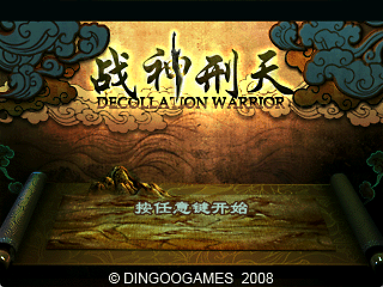 | ✅ Pass |
| Formula One | F1赛车 | `tmp/dingoo_game/Fomula-One.app` | 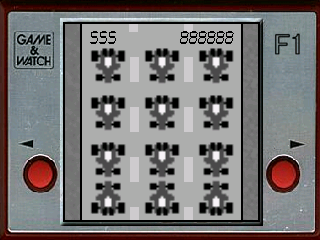 | ✅ Pass |
| GooPlayer | Goo播放器 | `tmp/dingoo_game/GooPlayer/GooPlayer.app` | 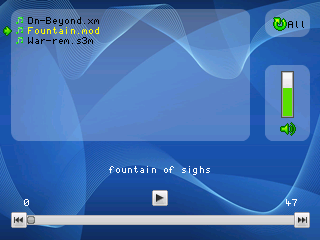 | ✅ Pass |
| Hell Striker II (2008-12-29 build) | 天地道（2008-12-29 版本） | `tmp/dingoo_game/Hell Striker II-20081229173817.app` | 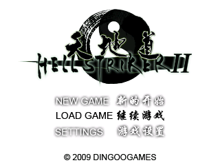 | ✅ Pass |
| Hell Striker II (2009-01-22 build) | 天地道（2009-01-22 版本） | `tmp/dingoo_game/Hell Striker II-20090122224048.app` | 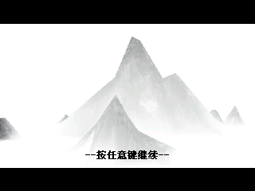 | ✅ Pass |
| Hexa-Virus | 六角病毒(病毒感染) | `tmp/dingoo_game/Hexa-Virus.app` |  | ✅ Pass |
| Landlord | 斗地主 | `tmp/dingoo_game/Landlord.app` |  | ✅ Pass |
| Link'em Up | 连连看 | `tmp/dingoo_game/Link'em Up.app` |  | ✅ Pass |
| Manic Miner | 疯狂矿工 | `tmp/dingoo_game/Manic-Miner.app` | 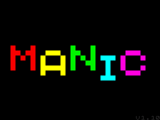 | ✅ Pass |
| Mine Sweeper | 扫雷 | `tmp/dingoo_game/Mine Sweeper.app` | 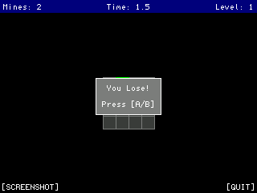 | ✅ Pass |
| Mushroom Roulette | 蘑菇轮盘 | `tmp/dingoo_game/Mushroom Roulette.app` |  | ✅ Pass |
| Nose Breaker | 卢比卢比 | `tmp/dingoo_game/Nose Breaker.app` | 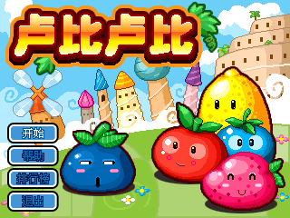 | ✅ Pass |
| Overlord Fighter (stub build) | 霸王战纪（桩版本） | `tmp/dingoo_game/Overlord-Fighter-Stub.app` | 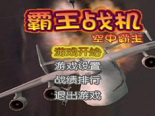 | ✅ Pass |
| Overlord Fighter | 霸王战纪(Yi-chi King Fighter) | `tmp/dingoo_game/Overlord-Fighter.app` |  | ✅ Pass |
| Platinum Sudoku | 白金数独 | `tmp/dingoo_game/Platinum Sudoku.app` | 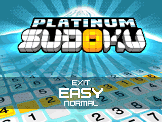 | ✅ Pass |
| PoPo Bash | 泡泡 | `tmp/dingoo_game/PoPo Bash.app` | 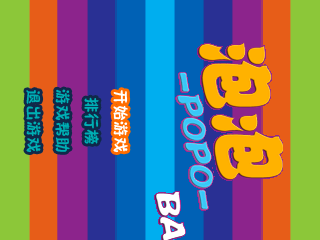 | ✅ Pass |
| Rick Dangerous | 里克危险 | `tmp/dingoo_game/Rick-Dangerous.app` | 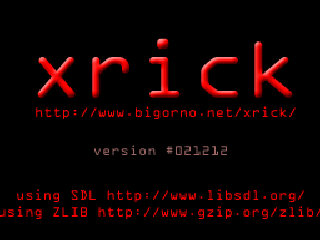 | ✅ Pass |
| Rubido (2009-05-12 build) | 鲁比多（2009-05-12 版本） | `tmp/dingoo_game/Rubido-20090512001427.app` | 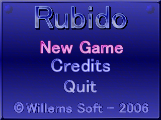 | ✅ Pass |
| Rubido (2009-05-16 build) | 鲁比多（2009-05-16 版本） | `tmp/dingoo_game/Rubido-20090516230856.app` |  | ✅ Pass |
| SameGoo | 消消乐 | `tmp/dingoo_game/SameGoo/samegoo.app` | 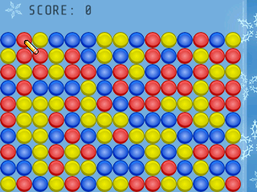 | ✅ Pass |
| Millipede | 千足虫 | `tmp/dingoo_game/Millipede.app` | 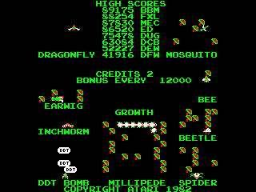 | ✅ Pass |
| Snake | 迪克蛇 | `tmp/dingoo_game/Snake.app` | 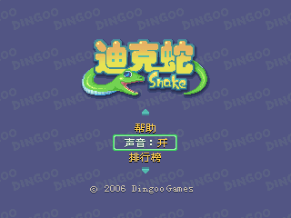 | ✅ Pass |
| Sokuban | 推箱子 | `tmp/dingoo_game/Sokuban/Sokuban.app` | 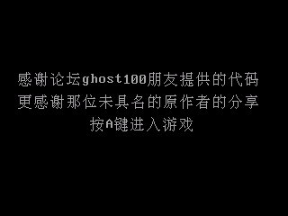 | ✅ Pass |
| Spoout | — | `tmp/dingoo_game/Spoout.app` | 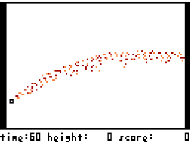 | ✅ Pass |
| StopWatch | 秒表 | `tmp/dingoo_game/StopWatch.app` | 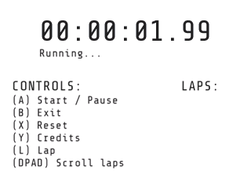 | ✅ Pass |
| Tetris | 俄罗斯方块 | `tmp/dingoo_game/Tetris.app` | 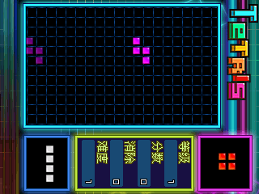 | ✅ Pass |
| Ultimate Drift (2008-07-16 build) | 极限漂移（2008-07-16 版本） | `tmp/dingoo_game/Ultimate Drift-20080716163042.app` |  | ✅ Pass |
| Ultimate Drift (2008-11-17 build) | 极限漂移（2008-11-17 版本） | `tmp/dingoo_game/Ultimate Drift-20081117180631.app` |  | ✅ Pass |
| Zero Gravity | 零重力 | `tmp/dingoo_game/Zero-Gravity.app` | 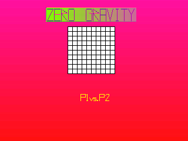 | ✅ Pass |
| Zhao-Chuan RPG | 赵云传 | `tmp/dingoo_game/Zhao-Chuan RPG.app` | 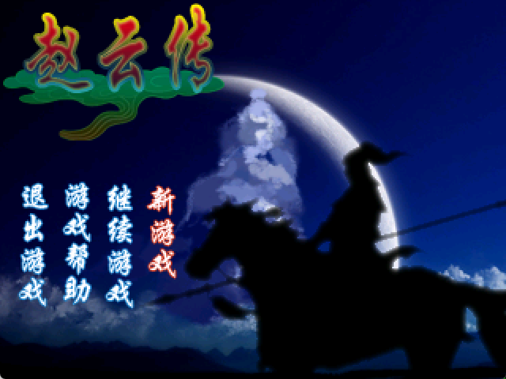 | ✅ Pass |
| Seven Nights (20081217192316) | 七夜（20081217192316） | `tmp/dingoo_game/7day-20081217192316.app` |  | ✅ Pass |
| Seven Nights (20090715110443) | 七夜（20090715110443） | `tmp/dingoo_game/7day-20090715110443.app` |  | ✅ Pass |
| Seven Nights (20090715111247) | 七夜（20090715111247） | `tmp/dingoo_game/7day-20090715111247.app` | 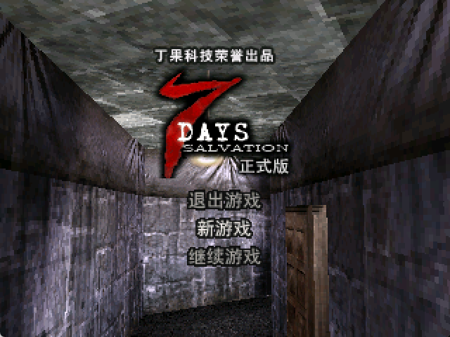 | ✅ Pass |
| Sword and Fairy (root build) | 仙剑奇侠传（根目录版本） | `tmp/dingoo_game/仙剑奇侠传.app` | 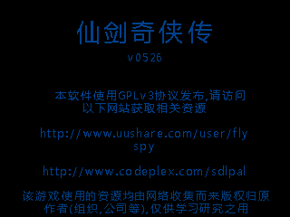 | ✅ Pass |
| Sword and Fairy (subdirectory build) | 仙剑奇侠传（子目录版本） | `tmp/dingoo_game/仙剑奇侠传/仙剑奇侠传.APP` | 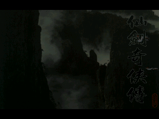 | ✅ Pass |

## Status Legend

| Symbol | Meaning |
|--------|---------|
| ✅ Pass | Starts successfully and renders a non-black frame. |
| ❌ Fail | Crashes, times out, or does not produce a usable screenshot. |
